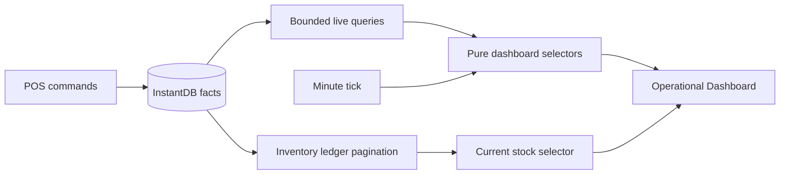

# DashboardNew → InstantDB: операционный Dashboard

**Дата:** 2026-07-31  
**Статус:** Согласован  
**Цель:** убрать runtime-зависимость Dashboard от Supabase и выпустить полезный операционный экран на bounded live-данных InstantDB, не загружая всю историю в браузер.

## Принятые решения

1. Первый релиз — операционный Dashboard, а не полная историческая аналитика.
2. Архитектура: bounded live queries сначала, дневные проекции — отдельной следующей фазой.
3. Supabase не остаётся fallback или compute-layer: целевой runtime — InstantDB-only.
4. В первом релизе склад показывает только текущий остаток по `inventoryMovements`; поставки, списания, склады и аномалии поставок отложены до миграции warehouse domain.
5. Food cost входит в первый релиз. Себестоимость ингредиентов фиксируется в persisted order-line snapshot при добавлении блюда и не пересчитывается по текущему рецепту задним числом.
6. Периоды «Неделя/Месяц», sparklines и таблица товаров возвращаются после появления дневных проекций.

## Текущее состояние

- `apps/admin/src/hooks/useDashboardNewData.ts` — монолитный hook на 1160 строк.
- Hook содержит 30 статических вызовов `.from(...)` и один динамический `.from(table)` к девяти Supabase-таблицам.
- Агрегация преимущественно выполняется в браузере через `filter`, `reduce` и `Map`; Supabase используется для range-фильтров, joins, limits и нескольких exact counts.
- `DashboardNew.tsx` одновременно показывает операционное состояние, KPI за сегодня, исторические периоды, алерты, хронологию и месячную таблицу блюд.
- InstantDB schema уже содержит `venues.timeZone`, индексированные даты на orders, shifts, payments, cash movements, inventory movements и order events.
- Установленный `@instantdb/core@1.0.52` поддерживает `$gt`, `$gte`, `$lt`, `$lte`; date-range queries не являются техническим блокером.
- Текущий `useInstantIngredientsDetailed` считает остатки из `inventoryMovements` с жёстким `limit: 9999`. Dashboard не должен копировать это ограничение: тихое усечение ledger даёт неверный остаток.

## Системная карта

### Участники

- **Управляющий:** хочет сразу видеть проблемы, смену, продажи и кассу.
- **Кассир/официант:** создаёт live-события через POS; Dashboard не должен мешать оплате или offline-сценарию.
- **POS-устройства:** могут писать одновременно и синхронизироваться после offline-периода.
- **Admin:** реактивно читает подтверждённые domain facts, но не является источником финансовой истины.
- **InstantDB:** хранит orders, payments, shifts, movements и immutable snapshots.

### Накопления и потоки

- Orders переходят `active → paid/cancelled`.
- Payment закрывает order и создаёт cash/inventory/order-event facts.
- Inventory movements образуют append-only ledger.
- Dashboard превращает ограниченный набор фактов в отображаемое состояние.
- История растёт без ограничения; поэтому month/week нельзя постоянно пересчитывать из всех raw rows.

### Главный leverage point

`payOrder` уже атомарно создаёт payment, inventory movements и paid event. Добавление cost snapshot в этот поток даёт корректный food cost без SQL и без повторного чтения текущего рецепта для старых продаж.

## Рассмотренные подходы

| Подход | Плюсы | Минусы | Решение |
|---|---|---|---|
| Полный прямой порт всех raw queries | Минимум новых сущностей | Большой payload, повторные reduce, плохой рост истории | Отклонён |
| Сразу построить все проекции | Масштабируемая аналитика с первого дня | Блокирует операционный релиз инфраструктурой агрегации | Отложен до второй фазы |
| Bounded live → дневные проекции | Быстрый InstantDB-only cutover, ограниченный payload, понятный путь роста | Историческая аналитика появляется позже | Выбран |
| Временно оставить Dashboard на Supabase | Самый короткий путь | Нарушает InstantDB-only cutover и оставляет две модели данных | Отклонён |

## Продуктовый контракт первого релиза

### Показываем live

#### Сегодня

- выручка по подтверждённым payments;
- количество оплаченных чеков;
- средний чек;
- расходы из кассы;
- food cost по зафиксированным order-line cost snapshots;
- тренд к такому же дню прошлой недели — отдельная выборка ровно за один день.

Все деньги остаются integer tiyin до форматирования в UI.

#### Смена и заказы

- есть ли активная смена;
- когда и кем она открыта;
- количество активных заказов;
- заказы старше 60 минут;
- незакрытая вчерашняя смена;
- вчерашние незакрытые заказы.

#### Алерты

- нет активной смены;
- вчерашняя смена не закрыта;
- заказ активен больше часа;
- расходы сегодня превышают выручку;
- выручка существенно ниже такого же дня прошлой недели;
- отрицательный или нулевой остаток;
- низкий остаток, только если для продукта задан `lowStockThresholdMilli`;
- подозрительное расхождение между order total и persisted order events, ограниченное сегодняшними заказами.

Time-based алерты пересчитываются локальным minute tick. Они не должны ждать нового события из InstantDB.

#### Хронология

Последние события текущего venue за сегодня, максимум 20 элементов:

- открытие/закрытие смены;
- оплата заказа;
- кассовый приход/расход;
- инвентарное движение.

События склада, которых ещё нет в InstantDB schema, не имитируются и не читаются из Supabase.

### Временно не показываем

- переключатель «Неделя/Месяц»;
- period KPI row;
- недельные sparklines;
- top/anti-top блюд за месяц;
- месячную таблицу товаров;
- поставки, списания и warehouse chronology;
- аномалии поставок;
- warehouse breakdown и названия складов;
- migration cards, не относящиеся к ежедневному управлению.

UI не должен показывать нули вместо недоступных исторических данных. Блоки удаляются до второй фазы чистым cutover.

## Архитектура первого релиза

### 1. Query layer

Добавить typed factories в `packages/data/src/operationalQueries.ts`:

- `adminDashboardTodayPaymentsQuery(venueId, start, end)`;
- `adminDashboardActiveOrdersQuery(venueId)`;
- `adminDashboardOrdersForDayQuery(venueId, start, end)`;
- `adminDashboardCashMovementsQuery(venueId, start, end)`;
- `adminDashboardShiftsQuery(venueId, start, end)`;
- `adminDashboardEventsQuery(venueId, start, end, limit)`;
- `adminDashboardInventoryPageQuery(venueId, cursor)`.

Правила query layer:

- каждый top-level entity фильтруется через `'venue.id': venueId`;
- day boundaries рассчитываются по `venues.timeZone`, а не по timezone браузера;
- диапазон всегда полуоткрытый: `$gte: start`, `$lt: end`;
- active orders ограничиваются статусом, historical orders — датой;
- chronology всегда имеет server order и limit;
- запрещены query factories вида `adminAll*` для Dashboard;
- arbitrary `9999` limits запрещены: inventory ledger читается cursor pagination до полного результата.

### 2. Selector layer

Вынести чистые функции без React и InstantDB:

- `selectTodayMetrics`;
- `selectShiftStatus`;
- `selectOperationalAlerts`;
- `selectChronology`;
- `selectInventoryBalances`;
- `selectStockAlerts`.

Selector получает уже ограниченные query results и `now`. Это позволяет:

- пересчитать time-based alerts по minute tick;
- тестировать пользовательские правила без моков React/InstantDB;
- не повторять reduce при изменении несвязанного UI state;
- держать money math в integer tiyin.

### 3. React hook layer

Публичный hook первого релиза: `useDashboardOperationalData`.

Он:

1. получает `venueId`, `venue.timeZone` и текущие day boundaries;
2. подписывается на bounded queries;
3. догружает все страницы inventory ledger без тихого усечения;
4. объединяет loading/error states по секциям;
5. вызывает memoized selectors;
6. обновляет `now` раз в минуту;
7. возвращает небольшой `DashboardOperationalData` вместо старого исторического `DashboardData`.

Не использовать TanStack polling поверх InstantDB subscriptions. Не делать один async waterfall из последовательных запросов.

### 4. UI layer

`DashboardNew.tsx` должен отображать независимые секции:

- Today KPI;
- shift/orders status;
- alerts;
- chronology;
- stock alerts.

Ошибка одной второстепенной секции не должна превращать весь экран в общий error state. Финансовые KPI и shift status считаются критическими: при их ошибке цифры скрываются, показывается явное сообщение и retry. Chronology/stock могут показывать собственное состояние ошибки, сохраняя остальные блоки.

Dismissed alerts остаются локальным UI state. Persisted dismissal не входит в эту миграцию.

## Cost snapshot и точный live food cost

### Изменение snapshot contract

Расширить `ConsumptionSnapshotLine`:

- `ingredientId`;
- `quantityMilli`;
- `unit`;
- `ingredientUnit`;
- `unitCostTiyin` — стоимость базовой единицы в момент добавления блюда;
- `costTiyin` — итоговая стоимость этой consumption line после unit conversion и integer rounding.

Добавить общий helper в `@lumo/data`, который:

- поддерживает только явно описанные пары `g ↔ kg`, `ml ↔ l`, `unit ↔ unit`;
- выполняет расчёт integer-safe;
- отклоняет неизвестные или несовместимые единицы;
- проверяет safe integer и неотрицательность стоимости.

### Изменение order/payment flow

1. `useInstantMenu` передаёт order editor текущие `costTiyin` и unit ингредиента.
2. `useInstantOrderEditor` строит immutable consumption + cost snapshot при добавлении блюда.
3. `addOrderLine` сохраняет snapshot вместе с order item.
4. Изменение recipe или ingredient cost после добавления не меняет сохранённую себестоимость заказа.
5. `payOrder` парсит persisted snapshots, суммирует `costTiyin` и записывает `payments.foodCostTiyin` в той же транзакции, что payment/order/inventory facts.
6. `payOrder` не принимает произвольный food cost из PaymentScreen.
7. Повтор `payOrder` с тем же idempotency key не создаёт дополнительную себестоимость.

Schema change:

- добавить `payments.foodCostTiyin`;
- добавить `products.lowStockThresholdMilli` как optional indexed/non-indexed numeric field по требованиям query layer;
- обновить seeds, import scripts и integration scenarios под новый обязательный snapshot contract.

Поскольку production-данных нет, использовать clean cutover parser без legacy fallback. Старые mock/seed snapshots пересоздать.

## Текущий остаток в первом релизе

Источник истины — полный append-only `inventoryMovements` ledger.

Первый релиз:

1. загружает ledger cursor pages;
2. суммирует `quantityDeltaMilli` по product;
3. соединяет результат с ingredient products;
4. показывает negative/zero/threshold alerts;
5. не делает warehouse breakdown, так как warehouse entities ещё отсутствуют.

Ограничения:

- нельзя считать отсутствие загруженной страницы нулевым остатком;
- stock section показывается только после полной initial pagination;
- новые movements должны реактивно менять уже рассчитанный остаток;
- performance измеряется на реалистичном ledger, а не только на 43 seeded movements.

Это сознательный переходный вариант. До выхода на большой ledger нужен `inventoryBalances` projection с периодической reconciliation по immutable movements. Projection не может обновляться небезопасным client-side `read → +delta → update`, потому что два POS могут потерять изменение друг друга.

## Дневные проекции: вторая фаза

После операционного cutover добавить:

### `venueDailyMetrics`

Детерминированный ключ: `venueId + localDate`.

Поля:

- `localDate`;
- `revenueTiyin`;
- `paidOrderCount`;
- `expenseTiyin`;
- `foodCostTiyin`;
- `updatedAt`;
- `sourceThrough` или другой reconciliation marker.

### `productDailyMetrics`

Детерминированный ключ: `venueId + localDate + productId`.

Поля:

- `quantityMilli`/`quantity` по принятой единице продажи;
- `revenueTiyin`;
- `foodCostTiyin`;
- `updatedAt`.

### Правила projection writer

- один доверенный writer через InstantDB Admin SDK;
- пересчёт из immutable facts, а не небезопасный client-side increment;
- idempotent upsert по deterministic ID;
- повторный запуск даёт тот же результат;
- исправление/refund пересчитывает затронутый local day;
- отдельный backfill для seeded history;
- сбой writer не блокирует оплату POS;
- lag видим через `updatedAt`, UI не выдаёт устаревшую аналитику за live.

После этого вернуть:

- week/month period switcher;
- daily sparklines;
- сравнение периодов;
- top/anti-top products;
- месячную таблицу.

## Поэтапный план реализации

### Этап 1. Зафиксировать behavioral contract

- [ ] Зафиксировать список блоков первого релиза и удалить исторические поля из нового UI contract.
- [ ] Определить day-boundary helper по `venue.timeZone`.
- [ ] Зафиксировать правила revenue, expense, paid check, average check и food cost.
- [ ] Зафиксировать пороги и действия каждого операционного алерта.

**Готово, когда:** для каждого отображаемого числа и алерта указан источник facts, диапазон времени и пользовательское действие.

### Этап 2. Добавить cost snapshot

- [ ] Расширить `ConsumptionSnapshotLine` и parser/serializer.
- [ ] Добавить unit conversion + integer cost helper.
- [ ] Передать ingredient cost/unit из menu в order editor.
- [ ] Добавить `payments.foodCostTiyin` в schema и `payOrder`.
- [ ] Обновить seeds/import и все callers нового snapshot contract.
- [ ] Push schema только после локальной типизации и сценариев data package.

**Готово, когда:** изменение ingredient cost после добавления блюда не меняет food cost уже созданной order line, а оплата записывает payment и его food cost одной транзакцией.

### Этап 3. Создать bounded InstantDB queries

- [ ] Добавить query factories в `@lumo/data`.
- [ ] Использовать `$gte/$lt` для today, yesterday и same weekday last week.
- [ ] Разделить active orders, today facts и recent events.
- [ ] Реализовать полную cursor pagination inventory ledger.
- [ ] Проверить venue scoping каждой top-level query.

**Готово, когда:** Dashboard не запрашивает all orders/all shifts/all events и не имеет arbitrary row cap, влияющего на итоговые значения.

### Этап 4. Вынести selectors

- [ ] Реализовать integer-safe KPI selectors.
- [ ] Реализовать shift/order alerts.
- [ ] Реализовать chronology merge с корректной сортировкой timestamp, не форматированной строки.
- [ ] Реализовать inventory balance и threshold selectors.
- [ ] Добавить minute tick как явный input `now`.

**Готово, когда:** одинаковые query facts и `now` всегда дают одинаковый `DashboardOperationalData`.

### Этап 5. Перевести hook и UI

- [ ] Заменить Supabase/TanStack hook на InstantDB subscriptions.
- [ ] Удалить week/month controls и historical blocks до второй фазы.
- [ ] Подключить Today KPI, shift status, alerts, chronology и stock.
- [ ] Разделить loading/error states по критическим и второстепенным секциям.
- [ ] Удалить mock fallback из production path.

**Готово, когда:** POS-события появляются на открытом Dashboard без reload и без polling, а ни один Dashboard runtime path не импортирует Supabase.

### Этап 6. Поведенческая проверка первого релиза

- [ ] Открыть смену на POS: Dashboard показывает активную смену без reload.
- [ ] Создать заказ: active order count обновляется.
- [ ] Оплатить заказ: revenue, checks, average check, food cost и chronology обновляются один раз.
- [ ] Повторить idempotent payment: KPI не удваиваются.
- [ ] Провести две оплаты с разных устройств: обе видны, ни одна не потеряна.
- [ ] Изменить ingredient cost после добавления order line: оплаченный food cost остаётся равен snapshot.
- [ ] Провести cash expense: expense KPI и alert обновляются.
- [ ] Дождаться перехода active order через 60 минут: alert появляется не позднее следующего minute tick без DB write.
- [ ] Создать negative inventory movement: stock alert появляется.
- [ ] Проверить границу суток в `venues.timeZone`, включая admin browser в другой timezone.
- [ ] Отключить сеть и восстановить: Dashboard возвращается к актуальному состоянию без двойного учёта.

### Этап 7. Дневные и inventory projections

- [ ] Добавить schema daily metrics.
- [ ] Реализовать idempotent Admin SDK writer и backfill.
- [ ] Добавить reconciliation и projection lag state.
- [ ] Вернуть historical UI на projections.
- [ ] Добавить `inventoryBalances` projection до того, как полный ledger станет неприемлемым для клиента.

**Готово, когда:** week/month Dashboard читает максимум число дневных/product projection rows за выбранный период, а не всю историю orders/orderItems/movements.

## Behavioral verification matrix

| Сценарий | Что видит управляющий | Какой баг защищаем |
|---|---|---|
| Один paid order | KPI и событие обновились один раз | двойной учёт realtime/optimistic update |
| Две одновременные оплаты | сумма и count включают обе | потерянное конкурентное обновление |
| Retry одного payment | значения не изменились повторно | нарушение idempotency |
| Цена ингредиента изменилась после заказа | старый чек сохранил исходный food cost | пересчёт истории текущими ценами |
| Нет активной смены | явный actionable alert | ложное нормальное состояние |
| Order стал старше часа без DB update | alert появился по minute tick | зависимость time alert только от realtime event |
| Browser в другой timezone | «Сегодня» совпадает с локальным днём venue | неверная граница периода |
| Inventory ledger больше одной страницы | остаток учитывает все страницы | тихое усечение `limit: 9999` |
| Ошибка chronology query | KPI остаются доступны | общий error screen из-за вторичной секции |
| Reconnect после offline | нет дублей и скачка итогов | повторная доставка facts |

Тесты должны проверять видимый результат и domain invariants, а не количество вызовов hooks или внутренние helper names.

## Условия полного Supabase cutover Dashboard

- в `DashboardNew.tsx` и новых dashboard hooks нет imports из `lib/supabase`;
- `useDashboardNewData.ts` удалён, а не оставлен как fallback;
- Dashboard не использует React Query polling;
- все facts venue-scoped;
- day boundaries используют `venues.timeZone`;
- money math выполняется в tiyin;
- food cost основан на immutable persisted snapshot;
- отсутствующие warehouse entities не подменяются Supabase-данными;
- smoke scenarios пройдены в двух открытых приложениях: POS и Admin.

## Риски и ограничения

1. **Inventory ledger растёт бесконечно.** Cursor pagination корректна, но не является финальной масштабируемой моделью. Нужен inventory balance projection до production-scale history.
2. **InstantDB не выполняет SQL aggregation.** Historical projections требуют отдельного доверенного writer, но POS payment flow не должен зависеть от его доступности.
3. **Snapshot фиксирует стоимость при добавлении блюда.** Это согласованное правило; оно защищает историю от изменения рецепта и цены до/после оплаты.
4. **Timezone обязателен.** Fallback на browser timezone запрещён, иначе два управляющих могут видеть разные Today KPI.
5. **Частичные данные опаснее ошибки.** Пока inventory pagination не завершена, UI показывает loading, а не рассчитанный из неполного ledger остаток.

## Открыто перед второй фазой

- среда запуска projection writer;
- допустимый projection lag;
- правила refunds/corrections для дневных метрик;
- порог перехода с client ledger pagination на `inventoryBalances`;
- состав warehouse chronology после миграции warehouse domain.
