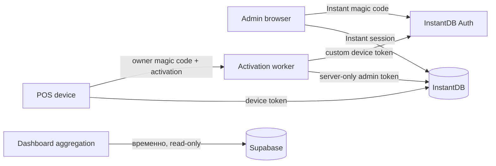

# Clean cutover на InstantDB Auth

**Дата:** 2026-08-07  
**Статус:** заменён планом `docs/plans/2026-08-11-instantdb-pure-operational-cutover.md`; сохранён как журнал предыдущего подхода
**Решение:** InstantDB — единственный identity provider для POS и admin. Supabase остаётся временным read-only источником для dashboard analytics, пока аналитика не будет заменена отдельным решением.

> Новый план убирает PostgreSQL operation ledger из operational path и переносит operations/version claims в одну atomic InstantDB transaction.

## Целевая архитектура

## Инварианты

1. Persistent operational data доступна только authenticated InstantDB identity.
2. Любой `view/create/update/delete` проверяет venue membership в Instant permissions; клиентский `where` — optimisation, а не security boundary.
3. POS использует ограниченный device token; admin — owner/manager identity.
4. Payment, stock receive/post/cancel и shift close идемпотентны; переходы статуса проверяются на trusted server, а не по устаревшему client snapshot.
5. Instant admin token существует только в trusted runtime secret store: не в Vite/Expo env, source, scripts или истории репозитория.
6. Operational lists используют bounded live queries и cursor pagination. Supabase dashboard не участвует в operational writes.

---

## Phase 0 — Containment и секреты

### Цель

Убрать уже существующий privileged access surface до функциональной миграции.

### Изменения

1. Ротировать все Instant admin tokens:
   - корневые development/staging/production env;
   - activation worker;
   - любые значения, ранее попавшие в диагностические scripts.
   - порядок: создать separate replacement token для каждого environment в Instant dashboard → записать его только в соответствующий trusted secret store → restart/verify worker health → revoke old token;
   - новый token не передаётся через chat, source, `.env.example` или client env; после ротации записать environment, secret-store location, rotation time и executor в incident record без значения token.
2. Удалить untracked scripts с literal admin token (`packages/data/test-*.mjs`, `check-emps.mjs`) или перевести их на `process.env`.
3. Удалить `VITE_INSTANT_ADMIN_TOKEN`. Любая `VITE_*` переменная доступна browser bundle.
4. Добавить secret scan в CI и pre-commit.
5. Приостановить production deployment до закрытия Instant permissions.

### Acceptance

- repository search не находит admin token literals;
- browser bundle не содержит privileged token;
- admin token доступен только trusted worker/runtime;
- production env не содержит admin credentials с `VITE_*` или `EXPO_PUBLIC_*` prefix.

---

## Phase 1 — InstantDB Auth в admin

### Цель

Admin session и Instant permissions используют одну identity.

### Изменения

1. Заменить Supabase auth в `AuthProvider`, `AuthGate`, `Login`:
   - убрать `supabase.auth.getSession`, `signInWithPassword`, `@supabase/supabase-js` из admin auth flow;
   - использовать `db.useAuth()`, `<db.SignedIn>`, `<db.SignedOut>`;
   - вход — Instant magic code, выход — `db.auth.signOut()`.
2. Оставить в `apps/admin/src/data/instant.ts` typed Instant client с `AppSchema`; не добавлять туда admin token.
3. Связать существующих owner/manager с Instant `$users`, `memberships`, `venues`, `organizations` идемпотентным миграционным script через Admin SDK:
   - canonical key — normalized email; заранее определить collision, disabled-user и missing-membership handling;
   - script создаёт/обновляет только ожидаемые links и роли, produces reconciliation report и безопасен для повторного запуска;
   - перед cutover вручную разрешить все unmatched/colliding identities; не переносить их по эвристике.
4. Переделать `useVenueId()`:
   - venue selection определяется memberships authenticated user;
   - `VITE_VENUE_ID` разрешён только в development build как seed default, не участвует в authorization и вызывает startup error вне development, если задан как tenant fallback.
5. Убрать Supabase client из auth/layout/login. До Phase 7 отдельный SQL client может оставаться read-only только для dashboard.

### Acceptance

- anonymous browser видит только login;
- Instant magic-code owner/manager видит только разрешённые venues;
- Supabase session без InstantDB session не даёт operational access;
- Instant logout немедленно закрывает доступ.

---

## Phase 2 — Deny-by-default Instant permissions

### Цель

Сделать Instant rules окончательной server-side security boundary.

### Изменения

1. Сохранить глобальный `$default: { allow: { $default: "false" } }`.
2. Убрать broad `"true"` для `view/create/update/delete` из всех venue-scoped namespaces.
3. Ввести переиспользуемые CEL predicates:
   - `isVenueDevice`: active device user данного venue;
   - `isVenueAdmin`: owner или manager данного venue;
   - `isVenueMember`: device или admin данного venue.
4. Для каждой entity зафиксировать mutation-invariant matrix: actor role, venue path, immutable links, mutable fields и допустимые state transitions. Rules обязаны запрещать:
   - relink записи к чужому `venue`, `order`, `warehouse`, `document` или `session`;
   - изменение accounting fields и immutable links после создания;
   - создание derived entity, связанной с record другого venue;
   - direct client mutation memberships, device authorizations и active-device links.
5. Для derived entities проходить links к venue:
   - `orderItems → order → venue`;
   - `recipeItems → dish → venue`;
   - `deliveryLines → document → venue`;
   - `inventoryLines → session → venue`.
6. Закрыть `$users`, devices, device authorizations, employees и PIN credentials:
   - device видит только свой venue;
   - admin видит только связанный venue;
   - device получает только verifier сотрудников своего venue и только для local unlock.
7. Добавить `$rateLimits` для Instant magic-code и client mutations; activation worker применяет отдельный per-IP, per-email и per-installation rate limit до `checkMagicCode`.
8. Оставить `attrs.create: false`.

### Acceptance matrix

- device venue A не читает и не мутирует venue B;
- owner venue A не читает venue B;
- anonymous Instant query не возвращает operational data;
- paid/cancelled order не редактируется;
- revoked device немедленно теряет read/write access;
- прямой Instant SDK query из browser DevTools не обходит tenancy.
- device/admin не может создать или relink record к чужому venue;

---

## Phase 3 — POS device lifecycle

### Цель

POS имеет только ограниченную device identity без environment-derived tenancy.

### Изменения

1. Activation worker — единственный issuer custom device tokens.
2. Убрать synthetic hardcoded development device IDs из production code path.
3. `bootstrapInstantDevice()` восстанавливает token, валидирует session и при revoke/expiry переводит устройство в activation-required.
4. `getVenueId()` и `getDeviceId()` — единственный source of truth для POS; убрать tenant fallback из `EXPO_PUBLIC_VENUE_ID`.
5. Удалить `POS_REFUND_RPC_ENABLED` и Supabase legacy flags.
6. При revoke worker инвалидирует auth session, снимает active-device link и создаёт audit event.
7. Для PIN поддержать offline unlock с ограниченным риском:
   - worker выдаёт только venue-scoped PIN verifier, employee ID, `credentialsVersion` и `expiresAt`; plaintext PIN никогда не передаётся и не хранится;
   - verifier, local attempt counter и lockout хранятся только в platform secure storage;
   - local verifier годен не более 24 часов после последней успешной credential sync;
   - после 5 неудачных попыток POS блокирует local unlock на 15 минут; unlock attempts сохраняются в durable local queue и отправляются worker-у при reconnect;
   - увольнение и PIN reset повышают `credentialsVersion`; device revoke инвалидирует device session и удаляет локальный credential cache; online POS блокирует credential сразу, offline POS — не позднее истечения cache TTL;
   - device identity по-прежнему обязательна для любой InstantDB mutation; offline unlock не расширяет venue access и не authorizes server writes.

#### Threat model offline verifier

- Offline verifier — ограниченный секрет, но не эквивалент server-side password hash: после компрометации устройства атакующий может извлечь encrypted-at-rest blob и пытаться перебрать шестизначный PIN вне UI.
- PBKDF2-SHA256 замедляет перебор, но пространство из $10^6$ PIN остаётся конечным; local lockout защищает штатный UI, а не атакующего с полным доступом к устройству.
- Риск ограничивается шестизначным PIN, platform secure storage, 24-часовым cache TTL, 15-минутным lockout после 5 ошибок, credential version/expiry, удалением cache при revoke и server-side device identity для каждой mutation.
- Offline unlock разрешает только локальный вход в UI. Verifier и employee identity не могут выпустить Instant token, выбрать другой venue или вызвать trusted worker command без действующего device token.
- Потерянное или скомпрометированное устройство нужно revoke немедленно. До reconnect локальный read-only/offline UI может оставаться доступным в пределах cache TTL; это явно принятый residual risk.

### Acceptance

- новая установка не открывает POS без activation;
- device не может подменить venue ID через client configuration;
- следующая mutation после revoke получает denial;
- повторная activation той же installation ID не создаёт второй device.
- local PIN verifier перестаёт разблокировать POS не позднее 24 часов после последней credential sync; 5 ошибочных PIN блокируют unlock на 15 минут.

---

## Phase 4 — Financial и warehouse commands

### Цель

Убрать stale client snapshot как источник truth и сделать accounting operations идемпотентными.

### Trusted command contract

1. Payment, refund, shift и warehouse endpoints принимают authenticated Instant session token; worker verifies token, current device status и actor membership before reading or mutating data.
2. Worker derives `venueId`, `deviceId`, actor identity and timestamps from verified identity/server clock, never from client request fields.
3. Каждый command принимает stable `operationId`, target ID и canonical request payload. В trusted `operations` ledger сохраняются: venue, kind, target, actor/device, request hash, status (`processing`/`committed`/`rejected`), result и timestamps.
4. Claim operation, check current target state, perform every ledger/stat mutation и persist result должны быть одной atomic trusted transaction. Повтор с тем же `operationId` и тем же request hash возвращает saved result без нового accounting effect; тот же ID с иным payload отклоняется.
5. Два разных operation ID не могут одновременно выполнить один transition: первый atomically claims active/draft target; второй получает committed result или domain error (`order_already_paid`, `document_already_received`).
6. До реализации проверить, что InstantDB поддерживает этот atomic claim/conditional transition. Если нет, Phase 4 блокируется до выбора отдельного transactional command runtime; read-then-transact не является допустимой заменой.
7. Worker limits request size, applies endpoint-specific rate limits and keeps operation results for срок, достаточный для client retry и reconciliation.

### Payment и shift

1. Перенести pay/refund/cancel-refund и shift open/close в trusted worker command layer.
2. Worker заново читает актуальное состояние перед mutation.
3. UI retry использует stable `operationId`, не `Date.now()`, и повторяет canonical payload до получения committed/rejected result.
4. Одна payment mutation включает payment, order status, cash movement, inventory movements, fiscal receipt, order event, operation result и daily stats.
5. `venueDailyStats` идентифицируется стабильной парой `(venueId, businessDay)` и обновляется `$inc` только внутри committed operation; client-side read-modify-write и swallowed accounting failures запрещены.

### Warehouse

1. Исправить replacement document lines:
   - stable line ID на `documentId + productId` или persistent client line UUID;
   - obsolete lines удаляются в том же transaction.
2. `receive/post/cancel` выполняются через worker:
   - current status повторно проверяется на server;
   - transition idempotency key делает repeat безопасным;
   - direct client mutation posted/received docs и their lines запрещена rules.
3. Inventory session фиксирует version/snapshot; нельзя silently overwrite stock, изменённый после начала инвентаризации.

### Acceptance

- два параллельных receive одной поставки увеличивают stock ровно один раз;
- edit draft delivery с удалением line не оставляет obsolete record;
- repeated receive/post/cancel возвращает прежний result без второго ledger effect;
- paid document нельзя переписать direct Instant mutation;
- две оплаты не теряют revenue/orderCount/foodCost.

---

## Phase 5 — Query contracts и производительность

### Цель

Не подписывать client на всю историю ресторана.

### Изменения

1. Переделать `adminAllOrdersQuery`, `adminAllShiftsQuery`, `adminCashMovementsQuery` на top-level cursor pagination (`first`, `after`, `pageInfo`).
2. Items/payments/orderEvents загружать для выбранной записи либо bounded date range, а не как nested payload всех records.
3. Live query оставить для active orders, active shift, floor state и bounded today operations.
4. Historical lists — explicit range/filter/load more.
5. Проверить schema indexes для predicate/order: status, openedAt, closedAt, occurredAt, day stats и warehouse document dates.
6. Проверить representative queries и rules в Instant Sandbox; client query timeout — 5 seconds.

### Acceptance

- history initial load не растёт вместе с полной базой;
- admin initial screen не запрашивает nested events/items/payments для всех orders;
- 30-day views имеют bounded payload;
- representative production queries проходят Sandbox latency check.

---

## Phase 6 — Build, tests и rollout gate

### Цель

Не выпускать migration без executable proof.

### Изменения

1. Исправить текущие build/type failures в `@lumo/data`, POS и admin.
2. Добавить integration tests на observable contracts:
   - unsigned admin → login;
   - Instant authenticated admin → только allowed venue;
   - device/admin не могут query, create или relink record к чужому venue;
   - revoked device loses new query/mutation access; cached local PIN expires within 24 hours;
   - duplicate activation → один device;
   - repeated `operationId` returns saved result with one ledger effect;
   - concurrent pay/receive/post with distinct operation IDs yields one committed transition;
   - reuse `operationId` with different request payload is denied;
   - document line replacement;
   - concurrent daily stats increments;
   - pagination next/previous.
3. Использовать отдельный Instant development app и disposable seeded data для integration tests.
4. Добавить CI gate:
   - data typecheck + tests;
   - POS typecheck + tests;
   - admin build;
   - permission integration matrix;
   - secret scan.
5. Rollout: development app → staging app → один production venue → все venues. Development, staging и production должны оставаться разными Instant apps.

### Definition of done

- all package builds/typechecks проходят;
- tenancy/security matrix проходит через `admin.asUser` и real client flow, включая cross-venue relink attempts;
- operation-ledger replay and concurrent-transition tests проходят against disposable Instant data;
- Supabase SDK отсутствует в POS/admin auth и operational mutation paths;
- нет broad permissions на tenant data;
- privileged token отсутствует в repository и client bundles;
- complete POS flow и warehouse lifecycle проходят against staging end-to-end.

---

## Phase 7 — Supabase retirement

### Цель

Закончить cutover без двух write sources of truth.

### Изменения

1. До миграции dashboard Supabase становится read-only analytics source; новые operational writes запрещены.
2. Для dashboard выбрать отдельное решение:
   - trusted worker, обновляющий pre-aggregated `venueDailyStats`; или
   - external SQL/OLAP projection из Instant events.
3. После миграции dashboard удалить `@supabase/supabase-js`, `lib/supabase.ts`, Supabase auth components, legacy RPC flags, migrations и stale docs.
4. Зафиксировать retention/export/rollback policy до выключения Supabase writes.

---

## Журнал реализации — 2026-08-07

### Выполнено

1. **Trusted POS command boundary**
   - Activation worker получил device-token-authenticated endpoints для создания/изменения/отмены заказов и позиций, оплаты, открытия/закрытия смены, cash movements, возврата и отмены возврата.
   - Worker получает `venueId` и `deviceId` только из active device identity; клиент их больше не передаёт.
   - Клиенты POS переведены с прямых operational writes на `posCommands` worker API для shift, payment, cash и refund flow.
   - Исправлен startup worker: `createServer` импортируется из `node:http`.

2. **Идемпотентность и конкурентность**
   - Добавлен PostgreSQL operation ledger (`worker_operations`) с canonical request hash, сохранением результата и per-operation locks.
   - Повтор с тем же `operationId` возвращает сохранённый результат; reuse ID с иным payload отклоняется.
   - Worker fail-fast возвращает `503`, когда `DATABASE_URL` не задан: POS mutation не выполняется без operation ledger.

3. **Tenant keys**
   - Добавлены scripts `audit:tenant-keys` и `backfill:tenant-keys` в `apps/activation-worker`.
   - В development backfill заполнил `venueId` у 745 записей на основе required venue relation; не найдено ambiguous/unlinked или conflict записей.
   - `venueId` стал required indexed schema field для 30 tenant-scoped entities.
   - Development audit после backfill: `status: ok`, 30 entities.

4. **Instant permissions**
   - Для `orders`, `orderItems`, `orderItemModifiers`, `shifts`, `payments`, `cashMovements`, `inventoryMovements`, `fiscalReceipts`, `orderEvents` и `kitchenTickets` прямые client `create/update/delete` установлены в `"false"`.
   - Tenant-scoped reads сохранены.
   - Schema и rules успешно запушены в development через `instant-cli v1.0.52`.

5. **Проверки**
   - `pnpm --filter @lumo/data typecheck` прошёл.
   - `pnpm --filter @lumo/activation-worker audit:tenant-keys` прошёл после backfill.
   - `pnpm verify:permissions` прошёл: direct order write, paid-order mutation, kitchen/inventory tampering, unassigned read, cross-venue create и daily stats mutation отклонены.
   - Legacy `pnpm verify:pos-flow` ожидаемо отклонён на первом direct device `openShift`: этот путь теперь запрещён rules.
   - Локальный worker поднялся и ответил `GET /healthz` с `{"ok":true}`; запрос с device token дошёл до operation boundary и корректно вернул `503` без `DATABASE_URL`.

### Исторические блокеры закрыты новым cutover

Этот вариант с PostgreSQL operation ledger не был выпущен: crash-window между PostgreSQL и InstantDB не позволял доказать exactly-once operational commit. Реализация заменена pure InstantDB архитектурой из `docs/plans/2026-08-11-instantdb-pure-operational-cutover.md`.

Итоговый production cutover:

1. `commandOperations`, version claims, target state и immutable accounting effects коммитятся одной InstantDB transaction.
2. `DATABASE_URL`, `worker_operations`, PostgreSQL advisory locks и `pg` удалены из command path.
3. Worker-backed HTTP scenarios проверяют device token → shift → order → line → payment/refund, replay, lost response и competing transitions.
4. Production schema, permissions, worker и admin развёрнуты; canary cleanup не показал изменений operational snapshot.

---

## Порядок исполнения

`Phase 0 → Phase 1 → Phase 2 → Phase 3 → Phase 4 → Phase 5 → Phase 6 → Phase 7`

Security boundary и auth закрываются до warehouse/dashboard polish.
