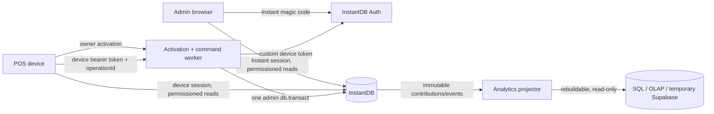

# Pure InstantDB operational cutover

**Дата:** 2026-08-11  
**Статус:** operational cutover завершён в production; rollout и reconciliation доказаны 2026-08-11  
**Заменяет:** `docs/plans/2026-08-07-instantdb-auth-clean-cutover.md`  
**Решение:** InstantDB — единственный source of truth для identity и operational data. Все command claims, state transitions, accounting records и результаты command выполняются одним `db.transact()`. PostgreSQL не участвует в operational idempotency или locking; он допустим только как rebuildable analytics projection.

## 1. Цель

Завершить clean cutover POS и admin на InstantDB без двух write sources of truth и без distributed transaction между InstantDB и PostgreSQL.

После cutover:

- admin входит через Instant magic code;
- POS работает под отдельной active device identity;
- клиент не задаёт trusted `venueId`, `deviceId`, actor identity или server timestamps;
- critical mutations проходят только через trusted command worker;
- operation result и все её operational effects фиксируются одной Instant transaction;
- повтор, параллельный transition и потерянный HTTP response не создают повторный accounting effect;
- mutable balances защищены monotonic versions и unique version claims;
- analytics является восстанавливаемой projection и не участвует в operational commit.

## 2. Целевая архитектура



### Operational truth

InstantDB хранит:

- identities, memberships, venues и devices;
- orders, lines, shifts, payments и cash movements;
- warehouse documents, stock balances и inventory movements;
- command operations и version claims;
- fiscal jobs, kitchen jobs и audit events;
- immutable financial/stat contributions.

Analytics store хранит только projection. Его потеря или отставание не блокируют POS и не меняют operational state.

## 3. Проверенные ограничения InstantDB

План опирается только на документированные или отдельно проверяемые свойства:

1. Все chunks одного `db.transact()` коммитятся атомарно или полностью откатываются.
2. `.unique()` гарантирует уникальность attribute и может служить atomic conflict primitive.
3. `lookup()` поддерживает адресацию по unique attribute, но не используется для competing claim creation: competing attempts должны создавать разные entities и конфликтовать по unique key.
4. Admin SDK обходит Instant permissions. Worker обязан проверять identity, tenancy и domain transition самостоятельно.
5. Публичная InstaML API не предоставляет documented `$inc` или general compare-and-swap operation.
6. Cursor pagination, ordering и limits поддерживаются только для top-level namespaces.
7. `$rateLimits` применяется из entity permission rules и считается per entity; он не заменяет rate limiting worker HTTP/auth endpoints.

## 4. Системная карта

### Участники

- **Waiter / cashier:** быстрый POS, безопасный retry после плохой сети.
- **Owner / manager:** разрешённые venues, warehouse и staff administration.
- **POS device:** минимальная venue-scoped identity, offline local unlock без privileged writes.
- **Command worker:** единственный trusted interpreter critical commands.
- **InstantDB:** atomic operational commit, auth, permissions и reactive reads.
- **Analytics projector:** eventually consistent, restartable и rebuildable.

### Накапливаемые records

- immutable command operations;
- immutable version claims;
- payments, cash movements, inventory movements и audit events;
- financial/stat contributions;
- operational entities с monotonic `version`.

### Главный leverage point

Unique claim на `(venue, resource, version)` превращает Instant unique constraint в optimistic concurrency primitive. Это устраняет PostgreSQL advisory locks и cross-database commit window.

## 5. Рассмотренные подходы

1. **Pure InstantDB — выбран.** Один operational store и один atomic commit. Concurrency реализуется unique version claims.
2. **PostgreSQL authoritative accounting.** Даёт SQL transactions, но требует outbox, projection, новой migration boundary и делает InstantDB вторичным operational view.
3. **PostgreSQL только для ledger/locks.** Отклонён: Instant commit и PostgreSQL commit нельзя сделать атомарными; crash между ними допускает replay или неопределённый result.

## 6. Непереговорные инварианты

1. Ни один command не пишет одновременно в два authoritative stores.
2. `commandOperation`, claims, target updates и immutable ledger effects одного успешного command находятся в одном Instant transaction.
3. Один `operationId` внутри venue навсегда связан с одним command kind, canonical payload, device/admin actor и result.
4. Один resource version может быть consumed только одним successful command.
5. `version` только растёт; client не передаёт новую version и не может изменять её напрямую.
6. Financial и warehouse effects представлены immutable records с deterministic business keys.
7. `venueDailyStats` и внешняя analytics не входят в payment/warehouse correctness boundary.
8. Admin token существует только в worker secret store. Client transactions никогда не получают privileged credentials.
9. Direct client writes в critical namespaces запрещены.
10. Любая tenant query и mutation проверяет membership/device link server-side; client `where` остаётся только performance constraint.
11. Plaintext PIN не хранится и не возвращается после установки.
12. Infrastructure error не сохраняется как final domain rejection.

## 7. Data model

### 7.1 `commandOperations`

Новая entity:

```ts
commandOperations: i.entity({
  operationKey: i.string().unique().indexed(),
  kind: i.string().indexed(),
  requestHash: i.string(),
  targetType: i.string().indexed(),
  targetId: i.string().indexed(),
  status: i.string().indexed(), // committed | rejected
  resultJson: i.string().optional(),
  errorCode: i.string().optional().indexed(),
  createdAt: i.date().indexed(),
  completedAt: i.date().indexed(),
})
```

Required links:

- `venue`;
- `device` для POS command или `adminUser` для admin command;
- `actorEmployee`, если command выполняется от сотрудника.

`operationKey = ${venueId}:${operationId}`. Entity ID создаётся новым random UUID для каждой processing attempt. Нельзя создавать operation через `lookup(operationKey)`: параллельные attempts должны конфликтовать по unique value, а не обновлять одну entity.

`requestHash` вычисляется из canonical envelope:

```text
{
  version,
  kind,
  venueIdDerivedByServer,
  deviceOrAdminIdDerivedByServer,
  actorEmployeeId,
  targetIds,
  normalizedPayload
}
```

Canonical serializer:

- рекурсивно сортирует object keys;
- удаляет `undefined` до hashing;
- запрещает `NaN`, `Infinity`, unsafe integers и неоднозначные date formats;
- нормализует strings и enum values до validation;
- не включает server-generated timestamps или random entity IDs.

### 7.2 `commandClaims`

Новая immutable entity:

```ts
commandClaims: i.entity({
  claimKey: i.string().unique().indexed(),
  resourceType: i.string().indexed(),
  resourceId: i.string().indexed(),
  resourceVersion: i.number().indexed(),
  createdAt: i.date().indexed(),
})
```

Required links: `operation`, `venue`.

Формат:

```text
claimKey = ${venueId}:${resourceType}:${resourceId}:v${resourceVersion}
```

Один command может создать несколько claims. Например payment claims:

- текущую order version;
- текущую shift version;
- другие mutable balances, если transaction действительно обновляет их.

Claims не удаляются в рамках cutover. Retention/archival допустим только после доказательства, что monotonic versions никогда не переиспользуются.

### 7.3 Versioned resources

Required integer `version` добавляется минимум в:

- `orders`;
- `shifts`;
- `stockItems`;
- `deliveryDocuments`;
- `writeOffDocuments`;
- `transferDocuments`;
- `inventorySessions`.

Backfill устанавливает `version: 0`. Каждый trusted update:

1. читает current version;
2. создаёт unique claim этой version;
3. записывает absolute next values;
4. устанавливает `version + 1` в том же transaction.

Версия не заменяет domain state validation. Worker сначала проверяет разрешённый transition, затем claim защищает проверку от stale concurrent write.

### 7.4 Immutable contributions

Добавить `financialContributions` либо эквивалентный immutable event contract:

- unique operation key;
- venue и `businessDay`;
- signed `revenueDeltaTiyin`;
- signed `foodCostDeltaTiyin`;
- signed `cashDeltaTiyin`;
- `orderCountDelta`;
- kind и occurredAt;
- links к payment/order/shift.

Contribution создаётся в той же transaction, что payment/refund/cancel-refund. `venueDailyStats` пересчитывается из contributions и не обновляется read-modify-write внутри payment.

### 7.5 PIN credentials

Удалить `employees.pin`. `employeePinCredentials` получает:

- `pinSalt`;
- `pinVerifier`;
- `credentialsVersion`;
- `updatedAt`;
- `expiresAt` для device cache contract.

Create/reset PIN выполняется worker command. Admin передаёт новый PIN только в HTTPS request; worker создаёт verifier и никогда не сохраняет plaintext.

## 8. Authoritative command protocol

### 8.1 Request

Каждый command принимает:

- stable client-generated UUID `operationId`;
- command-specific payload;
- Instant bearer token.

Запрещённые trusted request fields:

- `venueId`;
- `deviceId`;
- organization ID;
- authoritative timestamps;
- current totals/balances;
- next version.

### 8.2 Execution

1. Проверить bearer token через `db.auth.verifyToken()`.
2. Найти ровно одну active device/admin membership bounded query.
3. Вывести venue, device/admin identity и server timestamp.
4. Нормализовать payload и вычислить canonical `requestHash`.
5. Найти `commandOperation` по `operationKey`:
   - same kind/hash/actor → вернуть сохранённый committed/rejected result;
   - иной hash/kind/actor → `409 operation_id_mismatch`.
6. Bounded query загружает только target records и необходимые links.
7. Проверить venue ownership, actor status и domain transition.
8. Создать random operation entity, claims, target updates и immutable effects.
9. Выполнить один `db.transact([...])`.
10. Вернуть result, идентичный сохранённому `resultJson`.

### 8.3 Conflict handling

После unique conflict worker перечитывает:

1. `operationKey`;
2. каждый attempted `claimKey`;
3. актуальные target states/versions.

Решение:

- operation существует с тем же hash → replay stored result;
- operation существует с другим hash/actor → `409 operation_id_mismatch`;
- target transition уже завершён другим operation → stable domain error или winner result по command contract;
- target остаётся совместимым, но version изменилась из-за commutative command → recompute и bounded retry;
- conflict не объясняется operation/claim records → infrastructure error, без final operation record.

Внутренний retry ограничен, например, тремя попытками. POS получает retryable `409/503` с machine-readable code, а не бесконечный server loop.

### 8.4 Rejected operations

Deterministic domain rejection можно сохранить отдельной Instant transaction как `status: rejected`, если `operationKey` ещё свободен. Это делает повтор того же operation стабильным.

Не сохраняются как rejected:

- timeout;
- Instant/worker network failure;
- unknown transaction outcome;
- temporary dependency outage.

### 8.5 Crash semantics

- crash до `db.transact()` → operational effect отсутствует;
- crash во время transaction → Instant откатывает transaction;
- crash после commit до HTTP response → operation существует, retry возвращает saved result;
- analytics projector crash → operational command остаётся committed, projection догоняет или rebuilds.

## 9. Transition matrix

Перед реализацией для каждого command создать executable matrix:

| Command | Required state | Claims | Atomic effects |
|---|---|---|---|
| create order | open shift | shift version | operation, claim, order, created event |
| add/remove line | active order | order version | operation, claim, line mutation, total, event |
| cancel order | active order | order version | operation, claim, status, event |
| pay order | active order + open shift | order + shift versions | operation, claims, payment, status, cash movement, inventory movements, fiscal receipt, event, contribution |
| refund | paid order + open shift | order + shift versions | operation, claims, refund records, reversal movements, event, contribution |
| cancel refund | refunded order + open shift | order + shift versions | operation, claims, reversal records, event, contribution |
| open shift | no open shift | venue shift-slot claim | operation, claim, shift, audit event |
| close shift | open shift | shift version | operation, claim, status, reconciliation result |
| cash movement | open shift | shift version | operation, claim, movement |
| edit draft document | draft document | document version | operation, claim, replacement lines, new version |
| receive/write-off/transfer | allowed draft state | document + affected stock versions | operation, claims, status, stock absolute values, inventory movements |
| post inventory | open inventory session | session + affected stock versions | operation, claims, stock corrections, movements, status |

Open-shift uniqueness требует отдельного unique claim key, например `${venueId}:open-shift-slot`. Он не может быть одноразовым permanent key, если shifts открываются повторно. Поэтому slot claim должен включать monotonic venue `shiftEpoch`, либо venue получает versioned `shiftControl` resource, consumed при open/close.

## 10. Permissions model

### Global

```ts
$default: { allow: { $default: "false" } }
attrs: { allow: { create: "false" } }
```

### Client reads

- device: только linked active venue;
- owner/manager: только active memberships;
- `$users`: только self;
- PIN verifier: только active device своего venue;
- operations/claims: client read запрещён по умолчанию; при необходимости POS получает result через worker.

### Client writes

Всегда `false` для:

- `commandOperations`, `commandClaims`, `financialContributions`;
- orders, order items/modifiers, shifts;
- payments, cash/inventory movements;
- fiscal receipts, order events, kitchen tickets;
- stock balances и warehouse state transitions;
- memberships, devices, authorizations и PIN credentials.

Admin catalog/draft writes разрешаются напрямую только после Sandbox tests на create, update и cross-venue relink. Если prospective link нельзя надёжно проверить documented permission API, mutation переносится в admin worker command.

### Worker

Worker использует Admin SDK и поэтому не получает защиты от permissions. Для каждого endpoint обязательны собственные:

- token verification;
- bounded identity lookup;
- venue derivation;
- target tenancy checks;
- field allowlist;
- state and version validation.

`db.asUser({ token })` используется в permission integration tests и там, где worker намеренно должен применить client rules.

## 11. Query contracts

1. Worker никогда не загружает все devices, memberships, orders или documents.
2. Device lookup фильтруется по authenticated user link; installation lookup — по unique indexed `installationId`.
3. Membership lookup фильтруется по authenticated user и active status.
4. Operational live queries ограничены active/today range.
5. Historical screens используют top-level cursor pagination.
6. Nested items/events/payments загружаются для selected record или bounded range.
7. Для growing feed допустим `useInfiniteQuery`.
8. Predicate/order attributes индексируются до rollout.
9. Representative worker и UI queries проверяются в Instant Sandbox и на seeded staging dataset.

## 12. Phase 0 — Freeze, secrets и evidence

### Changes

1. Production operational rollout остаётся замороженным.
2. Ротировать leaked или shared Instant admin tokens по environment.
3. Удалить privileged literals и client-prefixed admin credentials.
4. Добавить secret scan в CI и pre-commit.
5. Сохранить development data snapshot и tenant audit report.
6. Зафиксировать, создавалась ли Railway `worker_operations` table и были ли в ней committed rows.
7. Проверить Instant development data на object-shaped values, созданные unsupported `$inc`, особенно `stockItems.quantityMilli`.

### Acceptance

- repository и client bundles не содержат admin token;
- production writes не менялись;
- есть data audit report и rollback snapshot;
- судьба существующего PostgreSQL ledger подтверждена данными, а не предположением.

## 13. Phase 1 — Identity и security boundary

### Changes

1. Завершить migration owner/manager identities по normalized email с reconciliation report.
2. Admin venue selection строится только из active Instant memberships.
3. Завершить device bootstrap, activation, revoke и session invalidation.
4. Удалить production tenancy fallback из `VITE_VENUE_ID` / `EXPO_PUBLIC_VENUE_ID`.
5. Закрыть direct client writes critical namespaces.
6. Добавить permission matrix для anonymous/device/admin/cross-venue actors.
7. Worker activation endpoints получают per-IP, per-email и per-installation limits.
8. Entity mutations получают подходящие `$rateLimits`; magic-code API не считается покрытым этими rules.

### Acceptance

- anonymous не читает operational data;
- device venue A не читает и не мутирует venue B;
- owner/manager видит только active memberships;
- revoked device теряет новые query/mutation access;
- browser DevTools не обходит tenancy;
- direct critical writes отклонены.

## 14. Phase 2 — Operation и claim primitives

### Changes

1. Добавить `commandOperations`, `commandClaims`, links и deny-all client rules.
2. Добавить required `version` fields и backfill `0`.
3. Реализовать canonical serializer и request hash fixtures.
4. Реализовать общий command runner:
   - identity derivation;
   - replay lookup;
   - validation;
   - operation + claims transaction;
   - conflict classification;
   - bounded retry;
   - stable error mapping.
5. Добавить fault injection только для integration environment: before transact и after commit/before response.
6. Проверить atomic unique-claim behavior на disposable Instant app.

### Acceptance

- same operation/payload возвращает один result;
- same operation с другим payload/actor получает mismatch;
- две операции не consume одну resource version;
- потерянный response не повторяет effect;
- unexplained infrastructure error не сохраняется как rejection.

## 15. Phase 3 — POS operational commands

### Changes

1. Перенести create/update/cancel order и line mutations на общий command runner.
2. Перенести shift, payment, cash, refund и cancel-refund.
3. Добавить versions/claims согласно transition matrix.
4. Все IDs ledger entities формируются worker-ом; business idempotency keys остаются immutable.
5. Создавать financial contribution в payment/refund transactions.
6. Удалить `apps/activation-worker/src/operation-ledger.mjs`, `pg` dependency и `DATABASE_URL` requirement.
7. Удалить PostgreSQL advisory lock keys и `worker_operations` bootstrap.
8. POS retries сохраняют один `operationId` и canonical payload до final result.
9. Заменить legacy direct `verify:pos-flow` на worker-backed HTTP scenario.

### Acceptance

- open shift → order → lines → payment проходит end-to-end;
- concurrent pay даёт один payment/accounting effect;
- close shift не пересекается с stale payment;
- refund/cancel-refund replay безопасен;
- worker работает без `DATABASE_URL`;
- direct POS writes остаются запрещены.

## 16. Phase 4 — Warehouse и stock concurrency

### Changes

1. Удалить все `$inc` updates.
2. Добавить `version` в stock balances и warehouse documents.
3. Любое balance изменение записывает absolute next quantity и consumes stock version claim.
4. Receive/write-off/transfer/post inventory выполняются одним command transaction.
5. Replacement lines получают persistent line UUID или stable `(documentId, productId)` key; obsolete lines удаляются атомарно.
6. Inventory session сохраняет observed stock versions; post отклоняет stale snapshot или требует явный rebase.
7. Провести reconciliation существующих stock balances против documents/movements до production schema tightening.

### Acceptance

- два concurrent receive увеличивают stock один раз;
- concurrent changes одного stock item не теряются;
- transfer atomically меняет source и destination;
- удалённая draft line не остаётся в data;
- stale inventory session не перезаписывает новый stock;
- schema не получает `{ $inc: ... }` как number value.

## 17. Phase 5 — Staff PIN clean cutover

### Changes

1. Добавить trusted create/reset/revoke credential commands.
2. Мигрировать активные PIN в verifier records либо потребовать controlled reset, если plaintext migration недопустима.
3. Добавить `credentialsVersion`, cache expiry и audit events.
4. Удалить `employees.pin` из schema, hooks, mutations, search и UI display.
5. POS хранит verifier, attempt counter и lockout только в platform secure storage.
6. Offline cache TTL — не более 24 часов; 5 failures → 15-minute lockout.
7. Online unlock attempts отправляются сразу; offline attempts queued durably и синхронизируются после reconnect.
8. Зафиксировать threat model: извлечённый low-entropy offline verifier подвержен brute force; рассмотреть 6-digit PIN и memory-hard verifier.

### Acceptance

- Instant query не возвращает plaintext PIN;
- admin не может прочитать установленный PIN;
- reset/revoke повышает credentialsVersion;
- offline verifier истекает в пределах 24 часов;
- local unlock не authorizes server mutation без active device identity.

## 18. Phase 6 — Queries и performance

### Changes

1. Исправить worker all-table scans для devices/memberships/installations.
2. Перевести admin historical lists на cursor pagination или `useInfiniteQuery`.
3. Убрать nested history payloads.
4. Добавить required indexes для statuses, dates, operation keys, claim keys и versions.
5. Ограничить subscriptions active/today records.
6. Проверить query latency и payload size на representative seeded dataset.

### Acceptance

- worker authorization cost не растёт линейно со всеми devices/memberships;
- initial history payload bounded;
- nested children не загружаются для всей истории;
- representative queries укладываются в установленный latency budget.

## 19. Phase 7 — Analytics projection и Supabase retirement

### Changes

1. `financialContributions` становится входом projection.
2. Projector хранит checkpoint и пишет absolute aggregates идемпотентно.
3. Projection можно полностью удалить и rebuild из Instant records.
4. До готовности projection Supabase остаётся read-only dashboard source.
5. После reconciliation удалить Supabase auth и operational mutation paths.
6. Определить retention, rebuild, backfill и dashboard freshness SLA.

### Acceptance

- сбой analytics не блокирует payment;
- повторная projection contribution не удваивает stats;
- full rebuild совпадает с operational payments/contributions;
- Supabase отсутствует в auth и operational writes.

## 20. Phase 8 — Executable proof и rollout

### Test levels

1. **Pure command tests:** canonicalization, validation и error contracts без mock assertions на внутренние calls.
2. **Instant integration:** disposable app, real schema, real permissions, real `db.transact()`.
3. **Worker HTTP integration:** real bearer tokens и observable API/results.
4. **Staging E2E:** POS and admin user flows.

### Required scenarios

- unsigned admin → login;
- allowed/cross-venue permission matrix;
- revoke during active session;
- duplicate activation → one device;
- same operation replay;
- operation ID payload mismatch;
- response loss after commit;
- concurrent add/remove line;
- concurrent pay with distinct operation IDs;
- payment versus shift close;
- concurrent receive/write-off/transfer;
- stock version conflict and retry;
- document line replacement;
- PIN expiry/reset/lockout;
- pagination next/previous and infinite load;
- analytics rebuild.

Tests assert user-visible result and final operational records, not helper call order.

### Rollout

1. Disposable development Instant app.
2. Development app with copied representative data.
3. Separate staging app and staging worker.
4. Staging venue canary with fault injection disabled after proof.
5. Production preflight: backups, token rotation, schema/perms diff, compatible client versions.
6. Production canary venue through temporary trusted `operationalWriteMode` gate if a rolling migration is required.
7. All venues migrated; direct legacy path removed.
8. Remove temporary rollout gate and compatibility code.
9. Remove PostgreSQL ledger table/service variable only after confirming it contains no unreconciled committed operations.

Rollback до production write cutover — previous app/client version. После первого new-model operational commit rollback выполняется только forward fix или documented data migration; старый worker нельзя включать поверх versioned claims.

## 21. CI gates

- `@lumo/data` typecheck and command tests;
- activation worker tests and build;
- POS typecheck/tests;
- admin build;
- disposable Instant schema push;
- permission integration matrix via real user tokens / `asUser`;
- command concurrency and fault-injection suite;
- tenant-key and stock reconciliation audits;
- secret scan;
- repository check запрещает `$inc`, `employees.pin`, client admin token prefixes и PostgreSQL operational ledger imports.

## 22. Definition of done

- InstantDB является единственным operational source of truth.
- Нет PostgreSQL locks/ledger в command path.
- Каждая critical operation атомарно сохраняет operation, claims, state и ledger effects.
- Replays, concurrent transitions и lost responses доказаны integration tests.
- Нет `$inc` assumptions; stock updates защищены version claims.
- Нет plaintext PIN.
- Critical direct client writes отклоняются.
- Worker queries bounded и indexed.
- Analytics полностью rebuildable и не блокирует POS.
- Supabase не участвует в auth или operational mutations.
- Staging E2E и production canary завершены без reconciliation differences.
- Temporary rollout gates и compatibility paths удалены.

## 23. Журнал завершения — 2026-08-11

- Development, disposable CI, isolated staging и production получили финальные schema и deny-by-default permissions.
- Production worker и admin развернуты с раздельными Instant credentials; admin magic-code session и authenticated dashboard проверены.
- Production POS/PIN canary подтвердил shift → order → line → payment, replay, refund, concurrent payment и trusted credential lifecycle.
- Snapshot после cleanup совпал с pre-canary snapshot по всем operational entities; временные auth identities удалены.
- `worker_operations` в Railway PostgreSQL отсутствовал; `DATABASE_URL`, PostgreSQL ledger code и `pg` dependency удалены из command path.
- Неиспользуемый Railway PostgreSQL service не удалён: Railway API и CLI вернули `Unauthorized` даже после повторной авторизации. Он не связан с worker и не является operational dependency.
- Production worker CORS ограничен доменом admin; сторонний Origin не получает `Access-Control-Allow-Origin`.

### Что было реализовано до native iPad acceptance

#### Operational transaction boundary

- PostgreSQL ledger/locks подход отклонён после разбора crash windows: запись `processing`, Instant commit и PostgreSQL result нельзя было сделать одним atomic commit.
- В `@lumo/data` добавлен единый Instant command runner с deterministic canonical request hash, venue-scoped operation keys, immutable `commandOperations`, unique `commandClaims` и monotonic resource versions.
- Один `db.transact()` сохраняет command result, version claim, target update и все payments, cash/inventory movements, order events, kitchen/fiscal jobs и financial contributions.
- Повтор идентичного `operationId` возвращает сохранённый result; reuse с другим payload отклоняется; competing state transitions конфликтуют на unique version claim.
- Critical POS и warehouse writes переведены на trusted worker. `venueId`, device identity и server timestamps выводятся из authenticated context, а actor/resource tenancy проверяется worker.
- Реализованы trusted flows для shift, order/line/meta, payment/cancel, refund/cancel-refund, cash movements, stock receive, write-off и transfer.

#### Identity, tenancy и PIN

- Admin переведён с Supabase auth на Instant magic code; active venue выводится из active membership, а owner/manager role назначается server-side.
- POS activation создаёт отдельную active device identity и custom token; device authorization можно revoke, после чего старый token перестаёт давать доступ.
- Plaintext `employees.pin` удалён. Worker создаёт versioned PBKDF2 verifier с salt и expiry; поддержаны create/reset/deactivate и offline verification без отправки PIN в InstantDB.
- Offline unlock получил TTL, failed-attempt lockout и replayable audit attempts.
- Tenant keys стали required/indexed для operational entities; bootstrap, backfill и audit scripts закрывают missing, ambiguous и cross-venue links.

#### Schema, permissions и query contracts

- Development, disposable CI, isolated staging и production получили одну schema и deny-by-default permissions.
- Direct client mutations critical POS entities запрещены; admin catalog/warehouse writes разрешены только через membership-scoped правила или trusted commands.
- Real-token permission matrix доказал allowed reads и отклонение unsigned, revoked, cross-venue и direct critical writes.
- Worker authorization и operational queries ограничены indexed/bounded contracts; добавлены performance proofs и guards против infinite operational reads.
- Репозиторный audit запрещает `$inc`, `employees.pin`, privileged client credentials и PostgreSQL operational-ledger imports.

#### Rebuildable analytics

- Payment/refund и связанные financial changes создают immutable `financialContributions`.
- Projector поддерживает deterministic replay, persisted idempotent checkpoints, daily-stat versions и полный rebuild.
- Projection outage только логируется: POS commit не блокируется и может быть восстановлен из operational contributions.
- Supabase оставлен read-only источником старого dashboard analytics; Supabase auth и operational writes удалены.

#### Rollout, reconciliation и delivery

- Development snapshot и tenant audit подготовлены до isolated staging rollout; representative dataset был скопирован и очищен после E2E.
- Production canary проверил shift → order → line → payment, identical replay после потерянного ответа, payload mismatch, concurrent payment, refund replay и PIN credential lifecycle.
- Production snapshot после cleanup совпал с pre-canary snapshot по operational entities; temporary users, memberships, claims и credentials удалены.
- Production worker CORS ограничен `https://lumo-admin-production.up.railway.app`; посторонний Origin получает ответ без `Access-Control-Allow-Origin`.
- Instant admin credentials раздельно ротированы для development, CI/staging и production; production worker после rotation прошёл health и canary.
- Railway PostgreSQL проверен напрямую: пользовательских таблиц и `worker_operations` нет; compute остановлен. Пустой service/volume остался только из-за `Unauthorized` ответа Railway delete API/CLI.
- Cutover опубликован в `master`. Workflow `Instant cutover quality` проходит data/worker/POS checks, real-token permission matrix, command fault injection, POS/analytics HTTP E2E, warehouse concurrency, staff credential proof, query performance, tenant/stock audits и secret scan.

#### Дополнительные native-исправления — 2026-08-12

- `App.tsx` и `useInstantShift.ts` изменены так, чтобы venue-scoped shift query был disabled до завершения device authentication.
- Загрузка offline PIN cache в `InstantLockScreen.tsx` перенесена после завершения employee query; промежуточный loading state больше не сохраняет пустой список сотрудников.


## 24. Официальные источники

- Instant transactions: https://www.instantdb.com/docs/instaml
- Unique constraints and indexes: https://www.instantdb.com/docs/modeling-data
- Admin SDK and permission bypass: https://www.instantdb.com/docs/backend
- Permissions, `newData`, `request.modifiedFields`: https://www.instantdb.com/docs/permissions
- Rate limits: https://www.instantdb.com/docs/rate-limits
- Auth and magic codes: https://www.instantdb.com/docs/auth
- Cursor pagination: https://www.instantdb.com/docs/instaql#pagination
- Infinite queries: https://www.instantdb.com/docs/infinite-queries
